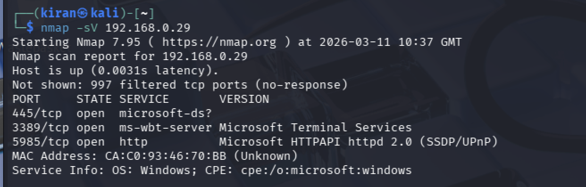

# Scenario 001 | Network Reconnaissance
 
## Engagement Context

As part of the Zaphod Bank SOC build, this scenario simulates the reconnaissance phase of an attack against Zaphod's internal corporate network. Once inside Zaphod's network, the attacker maps which ports and services are exposed to identify paths for lateral movement and further compromise. These ports were deliberately exposed to simulate an environment where network segmentation controls are immature, reflecting attack surface conditions documented in real-world financial sector breaches.

## MITRE ATT&CK Mapping
 
| Technique | ID | Tactic | Description |
|---|---|---|---|
| Active Scanning: Scanning IP Blocks | T1595.001 | Reconnaissance | Systematic port scanning to identify live hosts and exposed services |
| Active Scanning: Vulnerability Scanning | T1595.002 | Reconnaissance | Service version detection to identify potentially exploitable software |

## Environment
 
| Component | Details |
|---|---|
| Attacker machine | Kali Linux (192.168.0.118) |
| Target machine | Windows Server 2022 (192.168.0.29) |
| Network | Bridged (both machines on the same subnet, simulating internal network position post-compromise) |
| Tool used | Nmap 7.95 |

## Scenario Narrative
 
In this scenario the attacker has already gained an initial foothold on Zaphod's internal network, consistent with the assume breach posture that underpins Zaphod's detection strategy. From that position, the attacker performs active reconnaissance to identify which services are exposed on a target Windows Server, which informs their next actions.
 
This mirrors real-world attack patterns documented in the Verizon 2025 DBIR, where system intrusion accounted for 53% of breaches in EMEA, nearly doubling from 27% the previous year. Identifying exposed services such as RDP and SMB is a standard precursor to credential-based attacks and lateral movement.
 
 
## Reconnaissance Execution
 
**Command run from attacker machine (192.168.0.118):**
 
```bash
nmap -sV 192.168.0.29
```
 
The `-sV` flag instructs Nmap to perform service version detection. Rather than simply identifying whether a port is open, Nmap sends probe packets and analyses responses to determine the specific service and version running on each port. This gives an attacker significantly more actionable intelligence than a basic port scan.

**Scan results:**
 
```
PORT     STATE SERVICE       VERSION
445/tcp  open  microsoft-ds?
3389/tcp open  ms-wbt-server Microsoft Terminal Services
5985/tcp open  http          Microsoft HTTPAPI httpd 2.0 (SSDP/UPnP)
```
 
**Note on port 445:** Nmap returned `microsoft-ds?` with a question mark, indicating it detected SMB traffic but could not confidently match the response to a specific signature in its database. SMB has evolved significantly across versions (SMBv1, SMBv2, SMBv3) and different Windows versions respond differently to probes. A question mark in a scan result is worth noting during an investigation, it can indicate a non-standard configuration or a service behaving unexpectedly.
 
 
## Findings Analysis
 
### Port 445 | SMB (Server Message Block)
 
SMB is a file sharing and network communication protocol used extensively in Windows environments. From an attacker's perspective, an exposed SMB port on an internal network is a significant finding.
 
SMB has a long history of critical vulnerabilities with severe real-world consequences. The WannaCry ransomware attack in 2017 exploited EternalBlue, an SMB vulnerability, to spread across networks without any user interaction. In the UK, WannaCry caused an estimated £92 million in damage and disrupted NHS services across England, resulting in around 19,000 cancelled appointments.
 
For Zaphod specifically, exposed SMB creates a realistic path for ransomware to move laterally across internal servers. If ransomware encrypted Zaphod's infrastructure, customers would lose access to their accounts and banking services. Beyond the immediate customer impact, Zaphod would face serious regulatory consequences. Under DORA, Zaphod would be required to report the incident to the FCA within 4 hours of classification as a major ICT incident. Under PCI-DSS, any card transaction data exfiltrated before encryption would constitute a breach with significant financial penalties. The FCA's operational resilience rules require firms to remain able to deliver important business services even during severe disruption, a ransomware attack that takes core banking offline would represent a direct failure of that obligation.
 
### Port 3389 | RDP (Remote Desktop Protocol)
 
RDP allows remote graphical access to a Windows machine. It is one of the most consistently exploited services in attacks targeting financial institutions.
 
According to CISA advisory AA24-242A, RansomHub affiliates use RDP for lateral movement post-compromise after gaining initial access through phishing, vulnerability exploitation, or password spraying. Akira similarly leverages RDP internally once a foothold is established. An exposed RDP port with weak credentials therefore represents a significant risk, either as a direct brute force target or as a lateral movement path once an attacker is already inside the network.
 
This port is the primary target for Scenario 002, which simulates a brute force credential attack against the Administrator account.
 
### Port 5985 | WinRM (Windows Remote Management)
 
WinRM enables remote PowerShell execution and management. While less commonly targeted than RDP as an initial access vector, it is increasingly used for lateral movement and remote command execution once credentials have been obtained. PowerShell-based activity over WinRM can blend in with legitimate administrative behaviour, making it harder to detect without behavioural baselining.
 
Nmap also identified SSDP/UPnP running on this port. UPnP (Universal Plug and Play) is a protocol designed to let devices on a network automatically discover each other and communicate without manual configuration. It was built for home networks and has no authentication by default. Any device on the same network can query UPnP to enumerate services or potentially manipulate port mappings. Its presence on a corporate server is unusual and represents an additional reconnaissance opportunity for an attacker already on the internal network.
 
 
## Attacker Perspective
 
The scan results confirm a Windows Server 2022 target exposing three services consistent with an environment where network segmentation controls are immature. The findings provide the attacker with a clear path forward: RDP on port 3389 presents the most direct route to interactive access and is the primary target for the next attack phase. SMB on port 445 presents a lateral movement and ransomware propagation path once credentials are obtained. WinRM on port 5985 provides a PowerShell execution channel that may evade detection tooling focused on GUI-based activity. UPnP on the same port offers supplementary unauthenticated service enumeration.
 
 
 
## Defender Perspective

A port scan of this nature would generate a pattern of connection attempts across multiple ports within a short time window, consistent with automated scanning activity. A well-configured Sentinel analytics rule targeting connection volume from a single source IP would surface this behaviour as a reconnaissance alert.
Upon receiving such an alert, the SOC analyst should first confirm whether the source IP is a recognised internal asset such as an authorised vulnerability scanner or administrative host, cross-referencing against the asset inventory. If the source IP is unrecognised, the analyst should treat the activity as potentially hostile and escalate for further investigation. The analyst should also review whether the source IP has generated other alerts within the same time window, as reconnaissance activity frequently precedes credential attacks and may form part of a broader incident. The timing of the scan should be assessed against any scheduled internal scanning activity to rule out authorised sources. The combination of ports targeted, specifically RDP, SMB, and WinRM, is consistent with pre-attack enumeration rather than routine network activity and should be weighted accordingly during triage.

## References
 
- MITRE ATT&CK T1595 Active Scanning: https://attack.mitre.org/techniques/T1595/
- CISA RansomHub Advisory AA24-242A: https://www.cisa.gov/news-events/cybersecurity-advisories/aa24-242a
- Verizon 2025 Data Breach Investigations Report EMEA findings
- WannaCry NHS impact, National Audit Office report, October 2017
- Nmap documentation: https://nmap.org/docs.html
