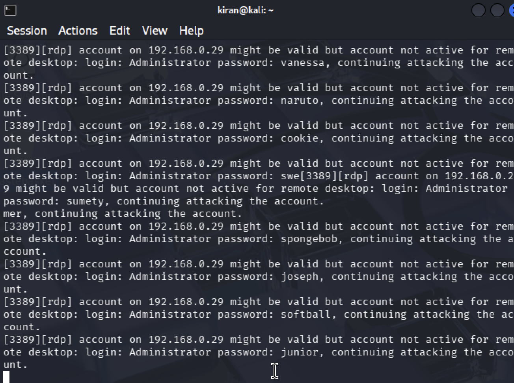
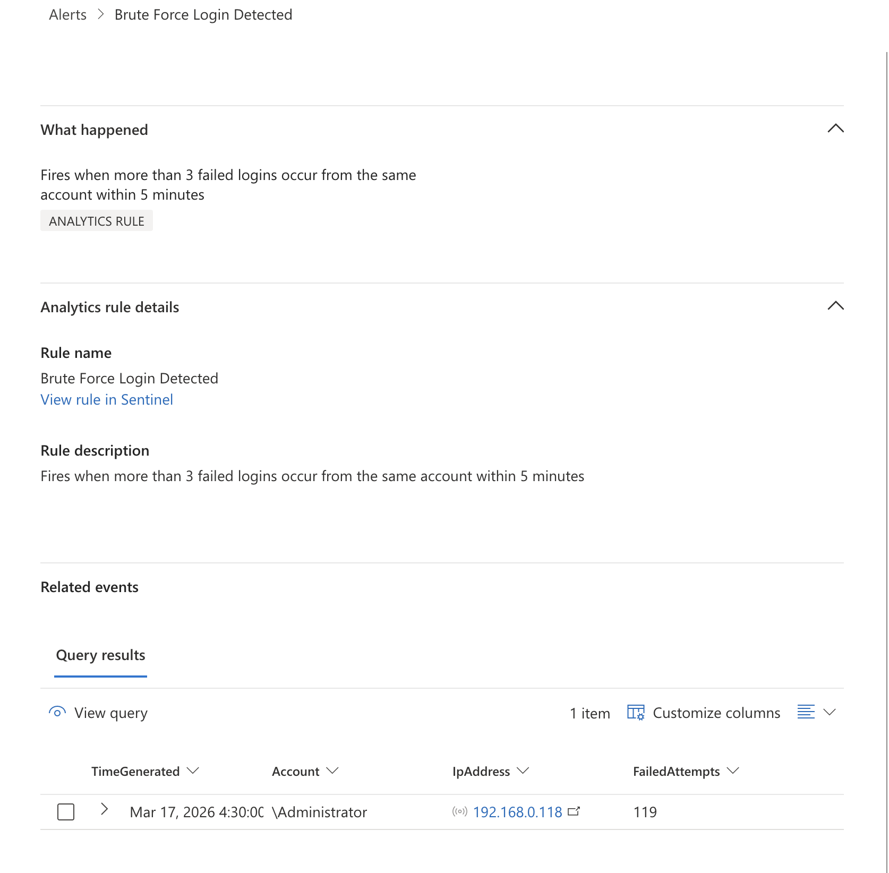

# Detection Rule | Brute Force Login Attack
 
## Threat Description
 
An attacker identified an exposed RDP service and systematically attempted to authenticate using passwords from a known leaked credential list, targeting the Administrator account to gain privileged access to Zaphod's internal infrastructure.

## MITRE ATT&CK
 
| Field | Detail |
|---|---|
| Tactic | Credential Access |
| Technique | Brute Force (Password Guessing) |
| ID | T1110.001 |
 
**Note on technique selection:** T1110.001 (Password Guessing) was selected over T1110.003 (Password Spraying) because the attack targeted a single account (Administrator) with many passwords. Password spraying targets many accounts with one password to avoid lockout thresholds, a different pattern requiring different detection logic.

## Log Source
 
Windows Security Event Logs, collected via Azure Monitor Agent and ingested into Microsoft Sentinel (table: `SecurityEvent`, channel: `Security`).
 
Event ID 4625 is generated natively by Windows on every failed authentication attempt. No additional tooling is required to capture this event, it is part of default Windows Security auditing.

## Detection Logic
 
The rule looks for more than 3 failed login attempts against the same account from the same IP address within a 5 minute window. This threshold is designed to catch automated brute force tools while avoiding false positives from legitimate users mistyping their password once or twice.
 
 
## KQL Query
 
```kusto
SecurityEvent
| where EventID == 4625
| where TimeGenerated > ago(5m)
| summarize FailedAttempts = count() by Account, IpAddress, bin(TimeGenerated, 5m)
| where FailedAttempts > 3
```
 
**Query breakdown:**
- `where EventID == 4625`  filters for failed logon events only
- `where TimeGenerated > ago(5m)` looks at the last 5 minutes of data
- `summarize FailedAttempts = count() by Account, IpAddress` groups failed attempts by account and source IP and counts them
- `where FailedAttempts > 3` only surfaces groups where more than 3 failures occurred
 
**Rule scheduling:** Runs every 5 minutes, looks back 5 minutes, alerts when query returns more than 0 results.
 
 
## Investigation Steps
 
When this alert fires, run the following query to get full context before taking any action:
 
```kusto
SecurityEvent
| where EventID in (4625, 4624, 4740)
| where TimeGenerated > ago(30m)
| project TimeGenerated, EventID, Account, IpAddress, LogonTypeName, LogonProcessName
| order by TimeGenerated desc
```
 
Look for:
- **4625**  failed attempts (expected in a brute force)
- **4624**  successful logon after failed attempts (worst case, attacker got in)
- **4740**  account lockout (attacker may have triggered automatic lockout)
 
Also check the `LogonTypeName` field, Type 3 (Network) indicates network-based authentication attempts. Type 10 indicates interactive RDP session.
 

 
## Response
 
Steps in order of priority:
 
1. **Check account lockout status**  verify whether the targeted account has been locked out. If locked, restore access for legitimate administrators before proceeding. A locked Administrator account is also a denial of service impact on Zaphod's operations.
 
2. **Block the source IP**  isolate the attacking IP at the firewall level to stop the attack immediately.
 
3. **Check for successful logins**  query for Event ID 4624 from the same source IP in the same time window. Any successful logon following a brute force pattern must be treated as a confirmed compromise and escalated to Tier 2 immediately.
 
4. **Report to FCA under DORA**  if the incident is classified as a major ICT incident, Zaphod is required to notify the FCA within 4 hours of classification. A sustained brute force attack against privileged accounts on production infrastructure would likely meet that threshold.
 
5. **Recommend RDP hardening**  direct RDP exposure should be remediated. Recommended controls: require VPN before RDP is reachable, re-enable Network Level Authentication (NLA), restrict RDP access to specific authorised IPs only.
 
 
## Validation
 
This rule was tested in the Zaphod Bank lab environment on 17 March 2026. Hydra v9.6 was run from Kali Linux (192.168.0.118) against Windows Server 2022 (192.168.0.29) using the rockyou.txt password list. The rule fired correctly within 5 minutes, generating a Medium severity incident in Microsoft Sentinel with the correct source IP, targeted account, and failed attempt count.

*Figure 1  Hydra v9.6 running from Kali Linux attempting passwords from rockyou.txt against Administrator account*


*Figure 2  Brute force incident fired in Microsoft Sentinel showing source IP 192.168.0.118 (Kali) and failed attempt count*
## Detection Status
 
| Field | Detail |
|---|---|
| Status | Closed |
| Severity | Medium |
| Created | 17 March 2026 |
| Validated | Yes, live test confirmed |
